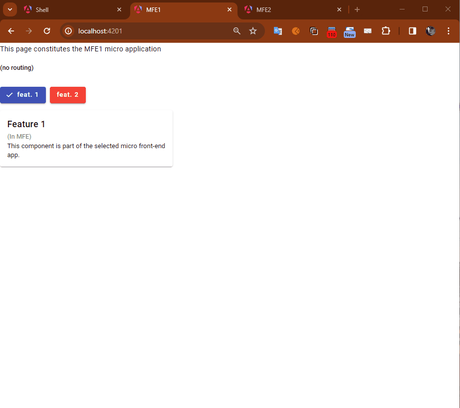

# Angular Micro Frontends Starter Application

This project was generated with [Angular CLI](https://github.com/angular/angular-cli) version 17.2.0.
It uses [Native Federation](https://github.com/angular-architects/module-federation-plugin) to architect it with micro frontends.

The following explained how this project boiler plate was setup.

## Demo



## Pre-requisites

Install Node.js LTS v20+, `enable corepack` in Node.js to enable __yarn__ and __pnpm__.

Install the Angular CLI version 17+ globally.

## Create the main project

To start creating this project for the first time, execute in the workspace folder of your choice in a Git Bash terminal:
- `ng new ng-mfe-app-starter --create-application false --package-manager yarn --ssr false --style scss`
- Open the project in VS Code. All the commands in the next chapters are supposed to be executed in a bash terminal of VS Code in the root folder of the application, or specified otherwise.
- (or `cd ng-mfe-app-starter` in the same bash terminal)

## Create some micro frontends

We are going to use the `ng g app` to generate application micro front-ends with the Angular CLI

### Create the app

- `ng g app shell --style scss --ssr false`
- `ng g app mfe1 --style scss --ssr false`
- `ng g app mfe2 --style scss --ssr false`

### Add some components

- Shell:
  - `ng g c navbar --project shell`
  - `ng g c home --project shell`
  - `ng g c not-found --project shell`
- MFE1:
  - `ng g c header --project mfe1`
  - `ng g c feat1 --project mfe1`
  - `ng g c feat2 --project mfe1`
- MFE2:
  - `ng g c navbar --project mfe2`
  - `ng g c home --project mfe2`
  - `ng g c page1 --project mfe2`
  - `ng g c page2 --project mfe2`

### Add some routing in the shell

Edit `projects/shell/src/app/app.routes.ts`

```ts
import { Routes } from '@angular/router';
import { loadRemoteModule } from '@angular-architects/native-federation';
import { HomeComponent } from './home/home.component';
import { NotFoundComponent } from './not-found/not-found.component';

export const routes: Routes = [
  { path: '', component: HomeComponent, pathMatch: 'full' },
  { path: '**', component: NotFoundComponent },
  // DO NOT insert routes after this one.
  // { path:'**', ...} needs to be the LAST one.
];

```

## Add some navigation

Edit the template of the navbar component in the shell (`projects/shell/src/app/navbar/navbar.component.html`) so that it is only:

```html
<nav [style]="{display: 'flex', gap: '0.5rem'}">
  <span>LOGO</span>
  <a routerLink="/">Home</a>
  <a routerLink="/mfe1">MFE1</a>
  <a routerLink="/mfe2">MFE2</a>
</nav>
```

Don't forget to import _RouterModule_ in the _navbar.component.ts_: `imports: [RouterModule],`.

Edit the template of the app component in the shell (`projects/shell/src/app/app.component.html`) so that it is only:

```html
<app-navbar />

<div [style]="{display: 'flex', flexDirection: 'column', padding: '1rem'}">
  <p>I am part of the host layout. All components are loaded in the dotted section below.</p>
  <div
    [style]="{padding: '1rem', borderRadius: '0.25rem', borderWidth: '2px', borderColor: 'rgb(14 165 233)', borderStyle: 'dashed'}">
    <router-outlet />
  </div>
  <p>I am part of the host layout.</p>
</div>
```

Don't forget to import _NavbarComponent_ in the _app.component.ts_: `imports: [RouterOutlet, NavbarComponent],`.

## Run and test the projects

Note: The port __4200__ will be reserved for the __shell__ application.

- `ng serve mfe1 -o --port 4201`
- `ng serve mfe2 -o --port 4202`
- `ng serve shell -o --port 4200`

## Add Native Federation

- `yarn add @angular-architects/native-federation@latest -D`

### Making an application a remote (Micro Frontend):

- `ng g @angular-architects/native-federation:init --project mfe1 --port 4201 --type remote`
- `ng g @angular-architects/native-federation:init --project mfe2 --port 4202 --type remote`

### Making an application a host (shell):

- `ng g @angular-architects/native-federation:init --project shell --port 4200 --type dynamic-host`

## Configuring the Host

`projects/shell/federation.config.js`

Nothing to modify here, the generated file looks like:

```js
const { withNativeFederation, shareAll } = require('@angular-architects/native-federation/config');

module.exports = withNativeFederation({

  shared: {
    ...shareAll({ singleton: true, strictVersion: true, requiredVersion: 'auto' }),
  },

  skip: [
    'rxjs/ajax',
    'rxjs/fetch',
    'rxjs/testing',
    'rxjs/webSocket',
    // Add further packages you don't need at runtime
  ]
  
});
```

## Configuring the Remote

`projects/mfe1/federation.config.js`

Nothing to modify here, the generated file looks like:

```js
const { withNativeFederation, shareAll } = require('@angular-architects/native-federation/config');

module.exports = withNativeFederation({

  name: 'mfe1',

  exposes: {
    './Component': './projects/mfe1/src/app/app.component.ts',
  },

  shared: {
    ...shareAll({ singleton: true, strictVersion: true, requiredVersion: 'auto' }),
  },

  skip: [
    'rxjs/ajax',
    'rxjs/fetch',
    'rxjs/testing',
    'rxjs/webSocket',
    // Add further packages you don't need at runtime
  ]
  
});
```

## Initializing the Host

When bootstrapping the host (shell), Native Federation (`projects\shell\src\main.ts`) is initialized (automatically generated file):

```js
import { initFederation } from '@angular-architects/native-federation';

initFederation('/assets/federation.manifest.json')
  .catch(err => console.error(err))
  .then(_ => import('./bootstrap'))
  .catch(err => console.error(err));
```

The function points to a federation manifest. This manifest lists the individual remotes. It can be exchanged when deploying the solution. Hence, you can adapt the build to the respective environment.

This is what the (also generated) federation manifest (`projects\shell\src\assets\federation.manifest.json`) looks like:

```json
{
	"mfe1": "http://localhost:4201/remoteEntry.json",
	"mfe2": "http://localhost:4202/remoteEntry.json"
}
```

Native Federation generates the `remoteEntry.json`. It contains metadata about the individual remote.

If you follow this tutorial, ensure this entry points to port `4201` for mfe1 and port `4202` for mfe2 (!).

## Initializing the Remote

When bootstrapping your remote (`projects\mfe1\src\main.ts`), Native Federation is initialized too:

```ts
import { initFederation } from '@angular-architects/native-federation';

initFederation()
  .catch((err) => console.error(err))
  .then((_) => import('./bootstrap'))
  .catch((err) => console.error(err));
```

After the initialization, it loads the file `bootstrap.ts` starting your Angular application.

## Loading the Remote

For loading a component (or any other building block) exposed by a remote into the host, use Native Federation's `loadRemoteModule` function together with lazy loading (`projects\shell\src\app\app.routes.ts`):

```ts
import { Routes } from '@angular/router';
// Add this import:
import { loadRemoteModule } from '@angular-architects/native-federation';
import { HomeComponent } from './home/home.component';
import { NotFoundComponent } from './not-found/not-found.component';

export const routes: Routes = [
  { path: '', component: HomeComponent, pathMatch: 'full' },
  // Add these routes:
  { path: 'mfe1', loadComponent: () => loadRemoteModule('mfe1', './Component').then((m) => m.AppComponent) },
  { path: 'mfe2', loadComponent: () => loadRemoteModule('mfe2', './Component').then((m) => m.AppComponent) },
  { path: '**', component: NotFoundComponent },
  // DO NOT insert routes after this one.
  // { path:'**', ...} needs to be the LAST one.
];
```

## Add concurrently

- Install concurrently: `yarn add concurrently@latest -D`
- Add the script in package.json: `"start:all": "concurrently \"ng serve mfe1\" \"ng serve mfe2\" \"ng serve shell\"",` 

## Starting the application

- run `yarn start:all`,
- or start first the micro front-ends then start the shell:
  - start the remotes: `ng serve mfe1 -o`, then `ng serve mfe2 -o`
  - once the remotes have started, start the shell: `ng serve shell -o`

Now, by clicking at the menu items MFE1 and MFE2 in the navigation, you can load the remote directly into the host.

## Adding Angular Material

Install `@angular/material`:

- `ng add @angular/material@latest`

There is at a moment an issue to configure the projects with Angular Material, and the previous command will output an error message "Project Name is required" after the installation of the package. Ignore the message, it is about the configuration of Material in the project. All micro frontends must be configured manually.

Do this for each single one of them, including the shell:

- Edit the `angular.json` file and __for each__ of the projects, add these 2 lines:
  - in "architect" > "test" > "options" > "styles": before `styles.scss`, add the theme style to use, for example: `"@angular/material/prebuilt-themes/indigo-pink.css",`
  - in "architect" > "esbuild" > "options" > "styles": before `styles.scss`, add the theme style to use, for example: `"@angular/material/prebuilt-themes/indigo-pink.css",`

Example for the shell (but it should also be for all the micro frontends):

```json
{
  "..."
  "projects": {
    "shell": {
      "..."
      "architect": {
        "..."
        "test": {
          "..."
          "options": {
            "..."
            "styles": [
              "@angular/material/prebuilt-themes/indigo-pink.css",
              "projects/shell/src/styles.scss"
            ],
            "..."
          }
        },
        "esbuild": {
          "..."
          "options": {
            "..."
            "styles": [
              "@angular/material/prebuilt-themes/indigo-pink.css",
              "projects/shell/src/styles.scss"
            ],
            "..."
          }
        },
        "..."
      }
    },
    "..."
  }
}
```


- Add the following to the top of the `styles.scss` file

```scss
/* You can add global styles to this file, and also import other style files */

html,
body {
  height: 100%;
}

body {
  margin: 0;
  font-family: Roboto, "Helvetica Neue", sans-serif;
}
```

- Add the 3 fonts from Google (Roboto, Material Icons and Material Symbols) to the `<head>` of the `index.html` file, and configure the typograhy globally by adding `class="mat-typography"` to the `body` element:

```html
<!doctype html>
<html lang="en">

<head>
  <meta charset="utf-8">
  <title>...</title>
  <base href="/">
  <meta name="viewport" content="width=device-width, initial-scale=1">
  <link rel="icon" type="image/x-icon" href="favicon.ico">
  <!-- Add the 3 fonts from Google (Roboto, Material Icons and Material Symbols): -->
  <link href="https://fonts.googleapis.com/css2?family=Roboto:wght@300;400;500&display=swap" rel="stylesheet">
  <link href="https://fonts.googleapis.com/icon?family=Material+Icons|Material+Icons+Outlined" rel="stylesheet">
  <link href="https://fonts.googleapis.com/icon?family=Material+Symbols+Outlined" rel="stylesheet">
</head>

<!-- configure the typograhy globally by adding the class "mat-typography" to the body element: -->
<body class="mat-typography">
  <app-root></app-root>
</body>

</html>
```

- edit `app.config.ts` to enable animations:

```ts
import { ApplicationConfig } from '@angular/core';
// Add this import:
import { provideAnimationsAsync } from '@angular/platform-browser/animations/async';
import { provideRouter } from '@angular/router';

import { routes } from './app.routes';

export const appConfig: ApplicationConfig = {
  // add the provider provideAnimationsAsync to the list:
  providers: [provideRouter(routes), provideAnimationsAsync()]
};
```

- That's it. You can try it out by adding some material elements:

```html
<mat-slide-toggle>Toggle me!</mat-slide-toggle>
<mat-icon>home</mat-icon>
<mat-icon fontSet="material-icons-outlined">home</mat-icon>
<mat-icon fontSet="material-symbols-outlined" color="accent">favorite</mat-icon>
```

## Add Routing Navigation inside a remote

For this to work, a `@NgModule` needs to be created in the MFE, and be exposed by Native Federation. Then in the shell routes definition load the module instead of the component.

### In the Remote:

- Start by creating a module inside the MFE: `ng g module main --project mfe2 --routing --flat`

This command will create 2 files in __mfe2__ collocated with _app.component.ts_: `main-routing.module.ts` and `main.module.ts`.

Now in the project __mfe2__:

- Add the following routes definition in `main-routing.module.ts`:

```ts
import { NgModule } from '@angular/core';
import { RouterModule, Routes } from '@angular/router';
import { HomeComponent } from './home/home.component';
import { Page1Component } from './page1/page1.component';
import { Page2Component } from './page2/page2.component';

// Add the following routes:
const routes: Routes = [
  {
    path: '',
    component: HomeComponent,
    title: 'MFE2',
    children: [
      { path: 'page1', component: Page1Component, title: 'MFE2 | Page 1' },
      { path: 'page2', component: Page2Component, title: 'MFE2 | Page 2' },
    ],
  },
];

@NgModule({
  imports: [RouterModule.forChild(routes)],
  exports: [RouterModule]
})
export class MainRoutingModule { }
```

- Edit `app.routes.ts` to be only for loading the module:

```ts
import { Routes } from '@angular/router';

export const routes: Routes = [
  { path: '', loadChildren: () => import('./main.module').then(m => m.MainModule) }
];
```

- If the main layout was in `app.component.html`, move it away in another component, and keep in the template file only the router outlet.

- For instance in the _home_ component `home/home.component.html`

```html
<div>
  <!-- Your navigation component: -->
  <app-navbar />

  <!-- ... some other markup part of the layout -->
  
  <!-- The Router Outlet to load all the different pages: -->
  <router-outlet />
  
</div>
```
- in the _app_ component `app.component.html`, keep only the following:

```html
<router-outlet />
```

- Use relative paths in your navigation components. When using relative paths, they will interprated correctly by both the micro frontend server in isolation, and also by the shell loading the MFE.

- So, in the template of the _navbar_ component of mfe2 `navbar/navbar.component.html`:

```html
<nav [style]="{display: 'flex', gap: '0.5rem'}">
  <!-- Note here the relative paths, starting with the dot: "./page1"  -->
  <a mat-button routerLink="./page1">Page 1</a>
  <a mat-button routerLink="./page2">Page 2</a>
</nav>
```

- Expose the created module in `federation.config.js`:

```js
// ... beginning of the file untouched
module.exports = withNativeFederation({
  name: 'mfe2',
  exposes: {
    './Component': './projects/mfe2/src/app/app.component.ts',
    // Add the following line to expose the module:
    './Module': './projects/mfe2/src/app/main.module.ts',
  },

  // ... rest of the file untouched
});

```

- Tests: run mfe2 in isolation `http://localhost:4202/`, and navigate inside the app:
  - `http://localhost:4202/page1` and `http://localhost:4202/page2` display their corresponding components

### In the Shell:

Now in the shell edit and update `app.routes.ts` in order to load the module of mfe2 instead of the main component:

```ts
export const routes: Routes = [
  { path: '', component: HomeComponent, pathMatch: 'full', title: 'Shell' },
  { path: 'mfe1', loadComponent: () => loadRemoteModule('mfe1', './Component').then((m) => m.AppComponent), title: 'MFE 1' },
  // Update for mfe2: use loadChildren instead of loadComponent, and load the './Module' and m.MainModule instead of the ./Component:
  { path: 'mfe2', loadChildren: () => loadRemoteModule('mfe2', './Module').then((m) => m.MainModule), title: 'MFE 2' },
  { path: '**', component: NotFoundComponent, title: 'Page Not Found' },
  // DO NOT insert routes after this one.
  // { path:'**', ...} needs to be the LAST one.
];
```

That's it. now the navigation works also in the shell

- Tests: run everything, and open the shell `http://localhost:4200/`, and navigate inside the shell:
  - `http://localhost:4200/mfe2` loads the mfe2 module
  - navigate inside the MFE2:
    - `http://localhost:4200/mfe2/page1` and `http://localhost:4200/mfe2/page2` display their corresponding components
